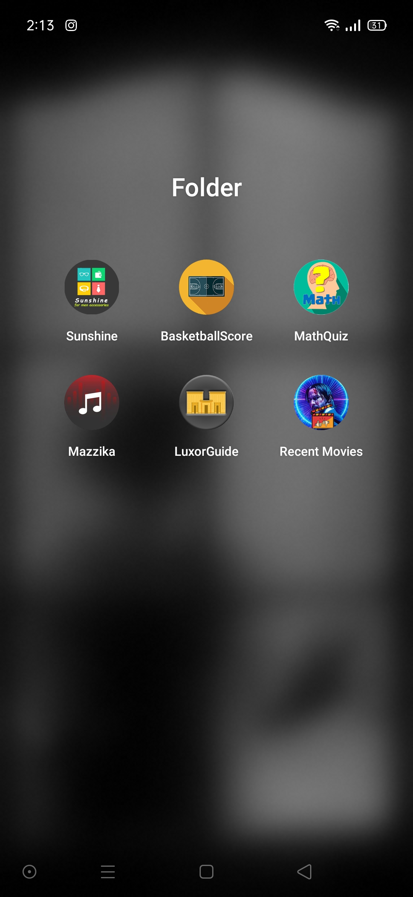

# ANDB-Projects
Six Mini Projects In Order To Obtain The Android Nanodegree From Udacity.

### For Sunshine App Screenshots [Click Here](https://github.com/Kareem100/ANDB-Projects/tree/main/1-Sunshine/app/src/screenshots)

### For BasketBallScore App Screenshots [Click Here](https://github.com/Kareem100/ANDB-Projects/tree/main/2-BasketballScore/app/src/screenshots)

### For MathQuiz App Screenshots [Click Here](https://github.com/Kareem100/ANDB-Projects/tree/main/3-MathQuiz/app/src/screenshots)

### For Mazzika App Screenshots [Click Here](https://github.com/Kareem100/ANDB-Projects/tree/main/4-Mazzika/app/src/screenshots)

### For LuxorGuide App Screenshots [Click Here](https://github.com/Kareem100/ANDB-Projects/tree/main/5-LuxorGuide/app/src/screenshots)

### For RecentMovies App Screenshots [Click Here](https://github.com/Kareem100/ANDB-Projects/tree/main/6-RecentMovies/app/src/screenshots)

## Projects Collection

