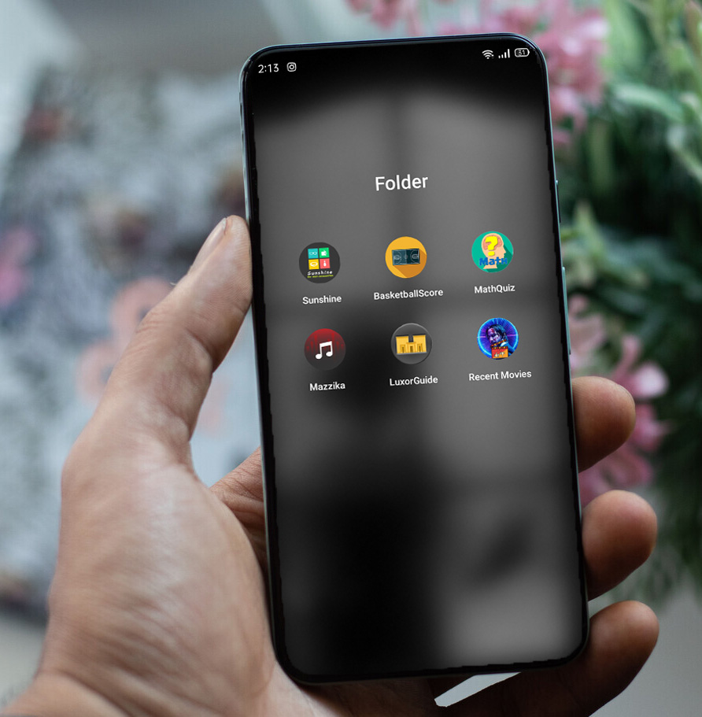

# ANDB-Projects

### Repository Description 

<b>This Repository</b> contains six mini projects.   
In order to obtain the android Nanodegree from Udacity.  
The experience is gradual from the first project as the simplest one to the last project as the complicated one.  
Every project covers a specific topic.  
It took me 8 months practising and the entertainment to complete the six.   

***

##### Tools and Topics Covered

- Android Core
- Managing strings, dimens, colors, layouts xml Files
- Control Flow
- OOP Concepts
- Locales Translation
- RecyclerView and Activity Lifecycle
- UI Design
- MediaPlayers
- Services and Receivers
- Clean Code and Refactoring
- JSON Parsing and HTTP Networking
- Threads and Parallelism
- Shared Preferences
- APIs
- SQLite
- ContentProvider and CustomLoader

***

## Screenshots

#### For Sunshine App Screenshots [Click Here](https://github.com/Kareem100/ANDB-Projects/tree/main/1-Sunshine/app/src/screenshots)

#### For BasketBallScore App Screenshots [Click Here](https://github.com/Kareem100/ANDB-Projects/tree/main/2-BasketballScore/app/src/screenshots)

#### For MathQuiz App Screenshots [Click Here](https://github.com/Kareem100/ANDB-Projects/tree/main/3-MathQuiz/app/src/screenshots)

#### For Mazzika App Screenshots [Click Here](https://github.com/Kareem100/ANDB-Projects/tree/main/4-Mazzika/app/src/screenshots)

#### For LuxorGuide App Screenshots [Click Here](https://github.com/Kareem100/ANDB-Projects/tree/main/5-LuxorGuide/app/src/screenshots)

#### For RecentMovies App Screenshots [Click Here](https://github.com/Kareem100/ANDB-Projects/tree/main/6-RecentMovies/app/src/screenshots)

*** 

##### Released APKs

[Mazzika-app](https://drive.google.com/file/d/17tvp8mDli6Loq4JCxOudPmU0D1gDmj2A/view?usp=sharing)
 
[RecentMovies-app](https://drive.google.com/file/d/1C-gRCAaAeTEkmP72kJxWjZrub0Nyi2xR/view?usp=sharing)

***

## Projects Collection

